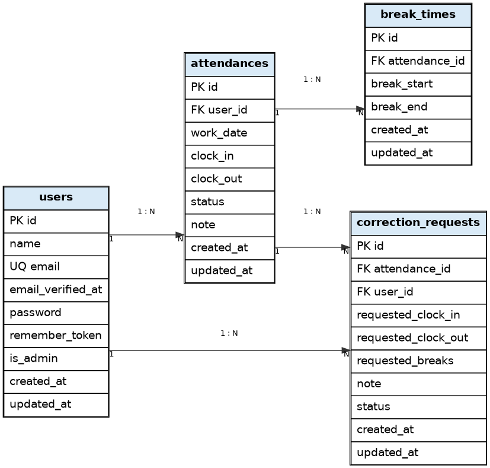

# Attendance Management App - 勤怠管理アプリ

## 概要

Laravelを用いて作成した勤怠管理アプリです。

---

## 環境構築
### Dockerビルド

```bash
git clone git@github.com:nozonosuke/mock_second.git
docker-compose up -d --build
```

### Laravel環境構築
```bash
docker-compose exec php bash
cp .env.example .env
composer install
php artisan key:generate
php artisan migrate
php artisan db:seed
```
---

## 環境構築時の注意点

- 本アプリはDockerを使用しています。
- DB接続エラー（Connection refused）が発生した場合は、
`.env` の DB 設定が Docker のサービス名と一致しているかを確認してください。

### 例（docker-compose 使用時）
DB_HOSTには `localhost` や `127.0.0.1` ではなく、 
`docker-compose.yml` に定義されている **MySQL のサービス名（例：mysql）** を指定します。

---

## 使用技術（実行環境）
- PHP 8.1
- Laravel 8.x（8.83.29）
- MySQL 8.0.26
- Nginx 1.21.1
- Docker / Docker Compose
- Git / GitHub

---

## ER図


---

## ディレクトリ構成
```bash
mock_second/
├── docker/
├── docs/
│   └── attendance_er_diagram.png
├── src/
│   ├── app/
│   ├── database/
│   ├── resources/
│   └── routes/
├── docker-compose.yml
└── README.md
```
---

## 機能一覧
### 認証機能
- Laravel Fortifyを使用
- 会員登録（メール認証対応）
- ログイン / ログアウト
- 認証制御（未ログイン時アクセス制限）

### 勤怠打刻機能
- 出勤打刻
- 退勤打刻
- 休憩開始 / 休憩終了
- 勤務ステータスの自動管理

### 勤怠一覧表示機能
- 月別勤怠一覧の表示
- 前月 / 翌月の切り替え
- 勤怠詳細画面への遷移
- 勤怠情報の視覚的表示（未入力は空白）

### 修正申請機能
- 勤怠時刻の修正申請
- 休憩時間の修正申請
- 修正理由（備考）の入力
- 申請一覧の表示（承認待ち / 承認済み）

### 管理者機能
- 管理者ログイン / ログアウト
- 日別勤怠一覧の表示
- スタッフ一覧の表示
- スタッフ別月次勤怠一覧の表示
- 修正申請の承認処理
- 勤怠データのCSV出力

---

## URL
### 開発環境（一般ユーザー）
- 会員登録：http://localhost/register
- ログイン：http://localhost/login
- 出勤登録：http://localhost/attendance
- 勤怠一覧：http://localhost/attendance/list
- 勤怠詳細：http://localhost/attendance/detail/{id}
- 申請一覧：http://localhost/stamp_correction_request/list

---

### 開発環境（管理者）

- ログイン：http://localhost/admin/login
- 勤怠一覧：http://localhost/admin/attendance/list
- 勤怠詳細：http://localhost/admin/attendance/{id}
- スタッフ一覧：http://localhost/admin/staff/list
- スタッフ別勤怠一覧：http://localhost/admin/attendance/staff/{id}
- 申請一覧：http://localhost/stamp_correction_request/list
- 修正申請承認：http://localhost/stamp_correction_request/approve/{attendance_correct_request_id}

※ {id} は該当データのIDが入ります

---

## テスト用アカウント

### 管理者ユーザー
- 名前：管理者ユーザー
- メールアドレス：admin@example.com
- パスワード：password

### 一般ユーザー
- 名前：一般ユーザー1
- メールアドレス：user1@example.com
- パスワード：password

### 一般ユーザー（別アカウント）
- 名前：一般ユーザー2
- メールアドレス：user2@example.com
- パスワード：password

※上記アカウントは `php artisan db:seed` 実行後に使用可能です。

## 単体テスト実行方法

本アプリでは `.env.testing` を使用してテスト環境を構築しています。

### ■ 1. テスト用環境変数

`.env.testing` が存在し、以下のように設定されていることを確認してください。

```env
APP_ENV=testing
DB_CONNECTION=sqlite
DB_DATABASE=:memory:

```
### ■ 2. phpunit.xmlについて
本リポジトリでは、phpunit.xml にDB関連の <server> 設定を記述しない構成としています。
Laravelでは以下の順で環境変数が適用されます：

phpunit.xml
.env.testing
.env

そのため、phpunit.xml に DB_DATABASE 等を記述すると
.env.testing の設定が上書きされる可能性があります。

本プロジェクトではDB設定は .env.testing に統一しています。

### ■ 3. テストの実行

Dockerコンテナ内で以下を実行してください。

```bash
docker-compose exec php bash
php artisan config:clear
php artisan test
```

### ■ 4. 補足事項
- テストクラスでは RefreshDatabase を使用しているため、
- テスト実行ごとにマイグレーションが自動で実行されます。
- .env.testing の設定が誤っている場合、Unknown database エラーが発生します。
- テスト用DBは本番用DBとは分離してください。
- テストは Docker 環境下での実行を前提としています。

---

## 主な設計ポイント
### 勤怠修正申請フロー
一般ユーザーが勤怠情報の修正申請を行い、管理者が承認することで勤怠情報に反映される設計としています。

- 修正申請は correction_requests テーブルで管理
- 申請中の勤怠情報は編集できないよう制御
- 管理者の承認後、attendances テーブルに修正内容を反映
---

## 起動方法
```bash
docker-compose up -d
php artisan migrate
php artisan db:seed
```
※ 初回のみ migrate と seed を実行してください
